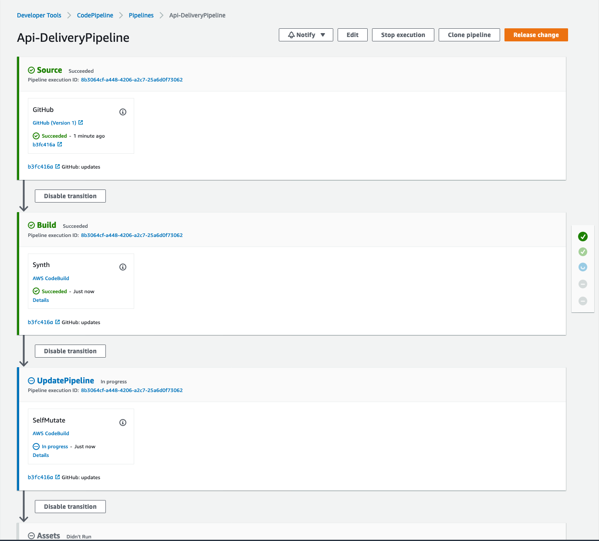
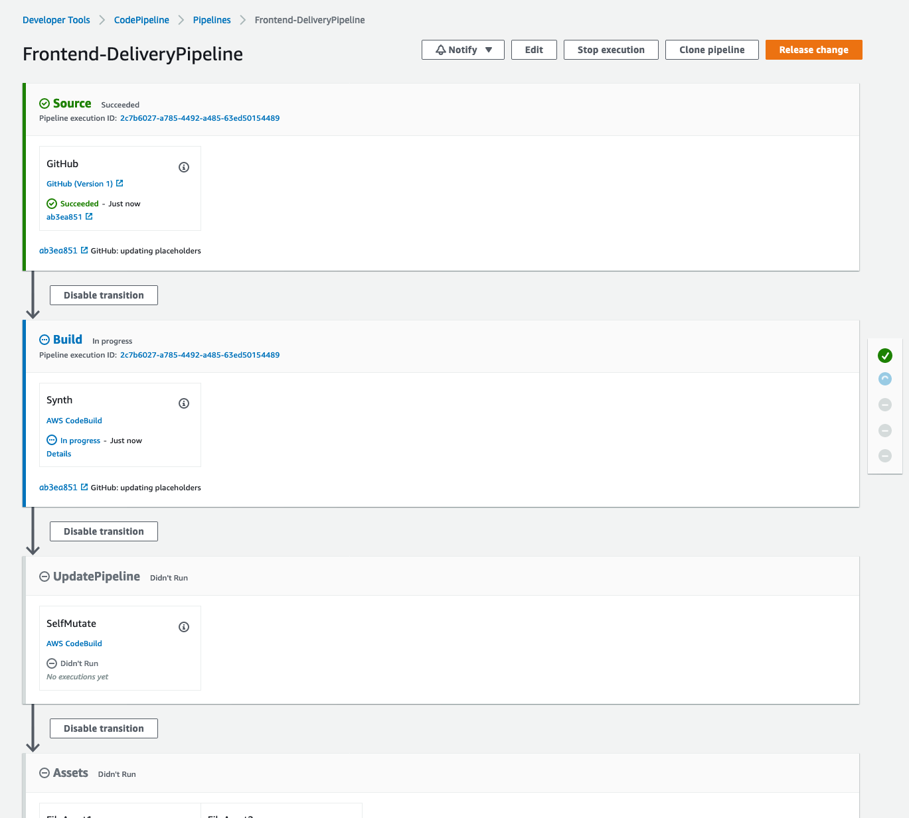
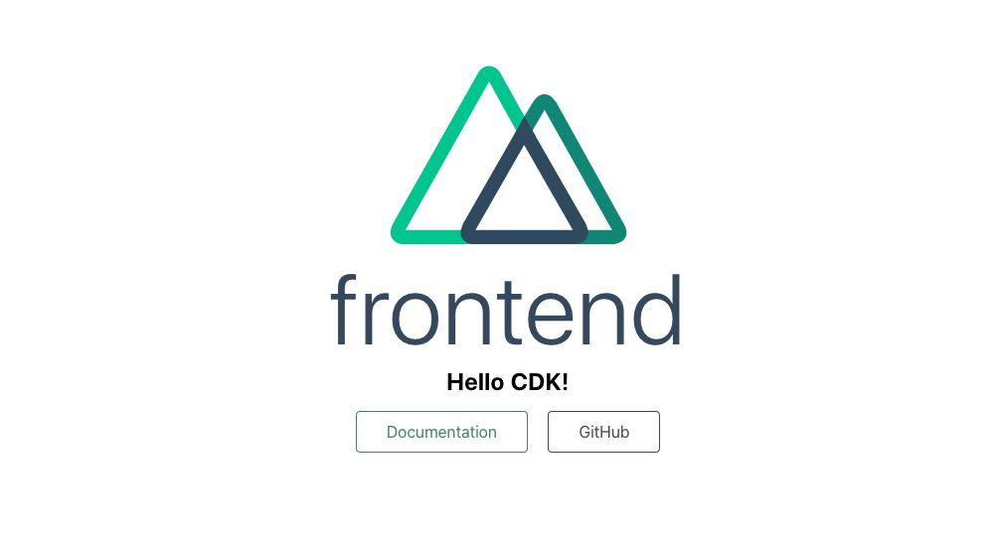

# Building, Bundling, and Deploying Applications with the AWS CDK

This is the sample code for the blog post [Building, bundling, and deploying applications with the AWS CDK](https://aws.amazon.com/blogs/devops/building-apps-with-aws-cdk/). 
I recommend reading through the blog post to get the context for the walkthrough below.

## Build source code

Some types of applications require you to build/compile the source code before it can be
deployed. In this repo we will walk through two different examples of this

1. [Golang Lambda](./cdk-bundle-go-lambda-example)
2. [Nuxt.js static site](./cdk-bundle-static-site-example) hosted on S3

## Prerequisites

To deploy the sample applications in this repo you will need to first make sure
you have a couple of things setup.

1. You will need a GitHub account and will need to create two repositories (1 for each sample application).
  a. Create 1 named `cdk-bundle-go-lambda-example`
  b. And another named `cdk-bundle-static-site-example`
2. You will need admin access to 1 AWS account.
3. Within that AWS account you will need to store a GitHub personal access token as a plaintext secret (not a JSON secret)
in AWS Secrets Manager under the name github-token

Most of the build commands will be run in CodeBuild, but if you would also like to run it locally you will
also need to have Docker and Golang installed locally.

Before we begin you will need to clone this repo locally and remove the `.git` directory.

```bash
$ git clone https://github.com/aws-samples/cdk-build-bundle-deploy-example.git
$ cd cdk-build-bundle-deploy-example
$ rm -rf .git
```

## Deploy the Golang Lambda application

### Setup

First we will work on deploying the Golang Lambda application with CDK Pipelines.
Navigate to the `cdk-bundle-go-lambda-example` folder and link it to your GitHub repo you created as
part of the prerequisites.

**replace `aws-samples` org with your GitHub org**
```bash
$ cd cdk-bundle-go-lambda-example
$ git init
$ git add .
$ git commit -m "first commit"
$ git branch -M main
$ git remote add origin git@github.com:aws-samples/cdk-bundle-go-lambda-example.git
$ git push -u origin main
```

Now install our NPM dependencies

```bash
$ npm install
```

Now lets update our app and replace some of the placeholder values.

Open the `lib/pipeline-stack.ts` file. This is where we define our
pipeline infrastructure using CDK Pipelines. Replace the placeholder value
for `owner`. 

Next edit the `bin/cdk.ts` file and replace the `account` and `region`
placeholder values with the information for the AWS account and region you
want to deploy this application to. 

### Bootstrap environment

Before you deploy the application you need to make sure the environment
where you are planning to deploy the pipeline to has been bootstrapped,
specifically with the newest version of the bootstrapping stack. 

You will need to bootstrap every environment you plan to deploy the CDK
application to, which in this example is a single account. 

You only need to do this one time per environment where you want to deploy
CDK applications. If you are unsure whether your environment has been
bootstrapped already, you can always run the command again. 

Make sure you have credentials for the account and run the following
command. Since we are only bootstrapping a single environment, we don't
need to specify the environment in the bootstrap command. The CLI will
know whih environment to bootstrap based on the stacks that are
configured. 

```bash
$ npx cdk bootstrap --cloudformation-execution-policies arn:aws:iam::aws:policy/AdministratorAccess
```

Once it is finished bootstrapping, we can provision the pipeline. Since the pipeline will run as soon
as it is created we want to make sure that our code has been committed to git.

```bash
$ git add .
$ git commit -m "updating placeholders"
$ git push
```

Now we will deploy the pipeline using `cdk deploy`. This is the only time we will need to run a cdk command locally,
all future updates will run through the pipeline. Before creating the pipeline make sure you have stored your GitHub token
in Secrets Manager. If you haven't done this already, you can do this from the AWS CLI with the command:

```bash
$ aws secretsmanager create-secret --name github-token --secret-string "REPLACE_WITH_GITHUB_TOKEN"
```

### Create the Pipeline

Before we create the pipeline and deploy our app, lets see what we are creating.

```bash
$ cdk synth
```

You should see output similar to this:

```bash
$ cdk synth
Bundling asset App/ApiStack/GolangFunction/Code/Stage...
go version go1.15.2 linux/amd64
=== RUN   TestHandler
--- PASS: TestHandler (0.00s)
PASS
ok      github.com/aws-samples/cdk-bundle-go-lambda-example/hello       0.003s
Resources:
  PipelineArtifactsBucketEncryptionKeyF5BF0670:
    Type: AWS::KMS::Key
........
```

Take a look at our `cdk.out` directory which contains our *Cloud Assembly*

```bash
$ tree cdk.out
cdk.out
├── Api-DeliveryPipeline.assets.json
├── Api-DeliveryPipeline.template.json
├── assembly-App
│   ├── AppApiStackB4F80476.assets.json
│   ├── AppApiStackB4F80476.template.json
│   ├── asset.7bf5f7851bbb819338dce5cc82b2b101e7b16fbbb018201e76efefd600eeb6aa
│   │   └── bootstrap
│   ├── cdk.out
│   └── manifest.json
├── cdk.out
├── manifest.json
└── tree.json
```

We have a top level *Cloud Assembly* that contains our single pipeline stack along with a nested *Cloud Assembly*
that contains our App `Stage` with our Lambda function asset.

Now lets deploy the app.

Run the below commands to create the pipeline which will create the infrastructure for our application
as well as deploy the application.

```bash
$ npm run build
$ npx cdk deploy '*'
```

If you scroll up in the logs you will notice that you don't see the same bundling commands as we did
when we ran `cdk synth`. This is becasue the CDK intelligently caches any bundled assets. This means that
if the source (what you pass to the `entry` prop) doesn't change, then bundling will not run again. This can
be especially helpful when you are sharing the source between stacks, for example deploying the same Lambda across
multiple environments.

After this completes, you should be able to view the pipeline in the AWS console.



At this point your API should be deployed. Get the URL of the API Gateway by running the
below AWS CLI command.

```bash
$ aws cloudformation describe-stacks --stack-name App-ApiStack --query 'Stacks[].Outputs[?OutputKey==`ApiUrlOutput`].OutputValue' --output text
```

curl the endpoint to see the response.

```bash
$ curl https://b3h861dboe.execute-api.us-east-2.amazonaws.com/hello
CDK!
```

## Deploy the Frontend Nuxt.js Static Site

### Setup

Next we will work on deploying the Frontend Nuxt.js static site with CDK Pipelines.
Navigate to the `cdk-bundle-static-site-example` folder and link it to your GitHub repo you created as
part of the prerequisites.

**replace `aws-samples` org with your GitHub org**
```bash
$ cd cdk-bundle-go-lambda-example
$ git init
$ git add .
$ git commit -m "first commit"
$ git branch -M main
$ git remote add origin git@github.com:aws-samples/cdk-bundle-static-site-example.git
$ git push -u origin main
```

Now install our NPM dependencies

```bash
$ npm install
```

### Update placeholders

Now lets update our app and replace some of the placeholder values.

Open the `lib/pipeline-stack.ts` file. This is where we define our
pipeline infrastructure using CDK Pipelines. Replace the placeholder value
for `owner`.

Next edit the `bin/cdk.ts` file and replace the `account` and `region`
placeholder values with the information for the AWS account and region you
want to deploy this application to. We also need to add the backend API Gateway URL
in the `apiUrl` property.

If you follow the `apiUrl` property through, you can see that we are using it to
populate an environment variable during the Nuxt.js build.

### Bootstrap environment

We shouldn't have to bootstrap the environment since we just did it prior to deploying
the backend application.

Since the pipeline will run as soon as it is created we want to make sure that our 
code has been committed to git.

```bash
$ git add .
$ git commit -m "updating placeholders"
$ git push
```

Now we will deploy the pipeline using `cdk deploy`. This is the only time we will need to run a cdk command locally,
all future updates will run through the pipeline.

### Create the Pipeline

Before we create the pipeline and deploy our app, lets see what we are creating.

```bash
$ cdk synth
```

You should see output similar to this (`...` used for brevity):

```bash
cdk synth
Bundling asset App/StaticSite/Deployment/Asset1/Stage...
1.22.4
yarn install v1.22.4
[1/4] Resolving packages...
[2/4] Fetching packages...
...
...
Done in 9.51s.
yarn run v1.22.4
$ nuxt generate
ℹ Production build  16:16:30
ℹ Bundling only for client side 16:16:30
ℹ Target: static 16:16:30
✔ Builder initialized 16:16:30
✔ Nuxt files generated 16:16:30
...
...
Done in 11.02s.
...
```

You can see the bundling commands are being run from the output.

Take a look at our `cdk.out` directory which contains our *Cloud Assembly*

```bash
$ tree cdk.out
cdk.out
├── Frontend-DeliveryPipeline.assets.json
├── Frontend-DeliveryPipeline.template.json
├── assembly-App
│   ├── AppStaticSite91B7692C.assets.json
│   ├── AppStaticSite91B7692C.template.json
│   ├── asset.4184245adc1f2ed71e1f0ae5719f8fd7f34324b750f1bf06b2fb5cf1f4014f50.zip
│   ├── asset.8d4a329837d97b046e81358499ed51ff81582e48b22a0e86a84649a3b923cf53
│   │   ├── 200.html
│   │   ├── README.md
│   │   ├── _nuxt
│   │   │   ├── 0dde08c.js
│   │   │   ├── 2f7945e.js
│   │   │   ├── LICENSES
│   │   │   ├── d0429f3.js
│   │   │   ├── d96b511.js
│   │   │   └── fe21e70.js
│   │   ├── favicon.ico
│   │   └── index.html
│   ├── cdk.out
│   └── manifest.json
├── cdk.out
├── manifest.json
└── tree.json
```

We have a top level *Cloud Assembly* that contains our single pipeline stack along with a nested *Cloud Assembly*
that contains our App `Stage` with our static site asset.

Now lets deploy the app.

Run the below commands to create the pipeline which will create the infrastructure for our application
as well as deploy the application.

```bash
$ npm run build
$ npx cdk deploy '*'
```

After this completes, you should be able to view the pipeline in the AWS console.



At this point your static site should be deployed. Get the URL of the CloudFront Distribution by running the
below AWS CLI command.

```bash
$ aws cloudformation describe-stacks --stack-name App-StaticSite --query 'Stacks[].Outputs[?OutputKey==`CloudFrontUrlOutput`].OutputValue' --output text
```

Go to the CloudFront URL and you should see your Nuxt.js static site displaying the message
from your backend API!



## Cleanup

To clean up, log into the AWS console and go to the AWS CloudFormation console of the Region you chose to deploy to.
Click on the following stacks and select delete: CdkBundle-DeliveryPipeline, Frontend-StaticSite, Backend-ApiStack, CDKToolkit.
You can also do this from the AWS CLI by running the below commands. You will need to make sure the first three stacks are
deleted prior to deleting the CDKTookit stack, and you may need to first empty the S3 Bucket created by the stack before
CloudFormation will allow you to delete it.

```bash
$ aws cloudformation delete-stack --stack-name App-StaticSite
$ aws cloudformation delete-stack --stack-name App-ApiStack
$ aws cloudformation delete-stack --stack-name Frontend-DeliveryPipeline
$ aws cloudformation delete-stack --stack-name Api-DeliveryPipeline
--- wait for above to finish deleting --
$ aws cloudformation delete-stack --stack-name CDKToolkit
```
